# 💾 Banco de Dados (PostgreSQL)

O Kestra 2.0 utiliza PostgreSQL como fonte única de verdade (Single Source of Truth), com uma arquitetura **Multi-Tenant Lógica** (todos os clientes no mesmo banco, separados por ID).

## 🗄️ Diagrama Entidade-Relacionamento (ER)

```mermaid
erDiagram
    clients ||--o{ chat_messages : "possui"
    clients ||--o{ client_files : "possui"
    clients ||--o{ client_providers : "possui"
    clients ||--o{ reminders : "possui"

    clients {
        UUID id PK "Identificador Único do Tenant"
        VARCHAR name "Nome da Empresa"
        TEXT system_prompt "Personalidade da IA"
        JSONB tools_config "Configurações de TOOLS"
        TIMESTAMP created_at
    }

    client_providers {
        UUID id PK
        UUID client_id FK "Cliente dono"
        VARCHAR provider_type "uazapi | meta | lancepilot"
        VARCHAR instance_name "Principal | Loja 2..."
        JSONB config "Credenciais do provider"
        BOOLEAN is_active
        BOOLEAN is_default
    }

    reminders {
        UUID id PK
        UUID client_id FK
        VARCHAR chat_id "Telefone do lead"
        TIMESTAMP scheduled_at "Quando enviar"
        TEXT message "Motivo/contexto"
        VARCHAR status "pending | sent | cancelled"
    }

    active_conversations {
        TEXT chat_id PK "Telefone/ID do Cliente Final"
        UUID client_id PK,FK "Dono da Conversa"
        TEXT status "active | finished"
        INT followup_stage "Estágio do Funil (0-5)"
        TEXT last_role "Quem falou por último"
        TIMESTAMP last_message_at "Para cálculo de inatividade"
        TEXT last_context "Resumo acumulado para o RAG"
    }

    chat_messages {
        SERIAL id PK
        UUID client_id FK "Dono da Mensagem"
        TEXT chat_id "Telefone do Cliente Final"
        TEXT role "user | assistant"
        TEXT content "Texto da Mensagem"
        TEXT media_url "Link S3/Meta (Opcional)"
        TIMESTAMP created_at
    }

    client_files {
        UUID id PK
        UUID client_id FK
        VARCHAR filename
        VARCHAR file_hash UK "Para evitar duplicatas"
        VARCHAR google_file_uri "URI no Gemini File API"
    }

    clients ||--o{ conversation_events : "registra"
    clients ||--o{ metrics_daily : "agrega"

    conversation_events {
        BIGSERIAL id PK
        UUID client_id FK
        TEXT chat_id "Conversa"
        VARCHAR event_type "msg_received | ai_responded | human_takeover..."
        JSONB event_data "Dados extras do evento"
        TIMESTAMPTZ created_at
    }

    metrics_daily {
        BIGSERIAL id PK
        UUID client_id FK
        DATE date "Dia da agregacao"
        INT total_conversations
        INT resolved_by_ai
        INT resolved_by_human
        INT human_takeovers
        INT avg_response_time_ms
        DECIMAL total_cost_usd
        JSONB tools_used "Contagem por tool"
    }
```



## 📋 Detalhe das Tabelas

### 1. `clients` (Mestre)
A tabela mais importante. Cada linha representa um **SaaS Tenant** (uma empresa cliente).

| Coluna | Tipo | Descrição |
| :--- | :--- | :--- |
| `id` | UUID | Gerado automaticamente (`gen_random_uuid()`). Chave Primária. |
| `name` | VARCHAR | Nome da empresa cliente. |
| `tools_config` | JSONB | Configurações das **Tools da IA** (consultar_cep, enviar_relatorio, criar_lembrete, etc). |

> **ADR-002 (2026-01):** O campo `token` foi **deprecado**. Credenciais de providers agora ficam em `client_providers`.

#### Exemplo de `tools_config` (JSONB):
```json
{
  "consultar_cep": {"active": true},
  "criar_lembrete": {"active": true},
  "enviar_relatorio": {"active": true, "grupo_id": "123..."},
  "consultar_viabilidade_hubsoft": {"active": true, "api_url": "...", "client_id": "..."}
}
```

### 2. `client_providers` (Provedores de Comunicação)
**Nova tabela (2026-01).** Armazena credenciais dos providers de WhatsApp.

| Coluna | Tipo | Descrição |
| :--- | :--- | :--- |
| `id` | UUID | Chave Primária. |
| `client_id` | UUID | FK para `clients`. |
| `provider_type` | VARCHAR | `uazapi`, `meta`, ou `lancepilot`. |
| `instance_name` | VARCHAR | Nome da instância (ex: "Principal", "Loja 2"). |
| `config` | JSONB | Credenciais específicas do provider. |
| `is_active` | BOOLEAN | Se está ativo. |
| `is_default` | BOOLEAN | Se é o provider padrão. |

#### Exemplo de `config` por provider:
```json
// Uazapi
{"url": "https://api.z-api.io/...", "token": "abc123..."}

// Meta (Oficial)
{"phone_id": "123...", "access_token": "EAA...", "waba_id": "..."}

// LancePilot
{"token": "...", "workspace_id": "...", "number": "..."}
```

### 3. `reminders` (Lembretes Agendados)
**Nova tabela (2026-01).** Armazena lembretes para follow-up agendado.

| Coluna | Tipo | Descrição |
| :--- | :--- | :--- |
| `id` | UUID | Chave Primária. |
| `client_id` | UUID | FK para `clients`. |
| `chat_id` | VARCHAR | Telefone do lead. |
| `scheduled_at` | TIMESTAMP | Quando enviar o lembrete. |
| `message` | TEXT | Motivo/contexto do lembrete. |
| `status` | VARCHAR | `pending`, `sent`, `cancelled`, `error`. |

### 4. `active_conversations` (State Machine)
Tabela vital para os **Workers de Follow-up**. Ela mantém o "estado atual" de cada conversa, permitindo que os scripts saibam quem precisa de resposta ou reengajamento.
*   **Chave Primária Composta:** `(chat_id, client_id)`. Garante 1 estado por cliente/conversa.
*   **`followup_stage`:** Controla em qual passo do funil de vendas o cliente está.
*   **`last_context`:** Uma "memória de curto prazo" que os Workers consultam para não perder o fio da meada.

### 5. `chat_messages` (Histórico)
Armazena o histórico de conversa para exibir na interface "Inbox 2.0" e para fornecer contexto ("Memória") para a IA.
*   **Particionamento:** Os dados não são fisicamente separados. A segurança é garantida pela cláusula `WHERE client_id = ...` em todas as queries no `saas_db.py`.


## 📊 Arquitetura de Métricas (Proposta ADR-003)

Para escala e análise de métricas da IA, o sistema adota **3 camadas**: Event Log + Agregação Pré-calculada + Leitura Instantânea.

### Camada 1: `conversation_events` (Source of Truth)

Tabela append-only que registra cada transição de forma imutável. Custo: 1 INSERT por evento (~0ms extra).

```sql
CREATE TABLE conversation_events (
    id          BIGSERIAL PRIMARY KEY,
    client_id   UUID NOT NULL REFERENCES clients(id),
    chat_id     TEXT NOT NULL,
    event_type  VARCHAR(50) NOT NULL,
    event_data  JSONB DEFAULT '{}',
    created_at  TIMESTAMPTZ NOT NULL DEFAULT NOW()
);

CREATE INDEX idx_conv_events_client_time ON conversation_events (client_id, created_at);
CREATE INDEX idx_conv_events_chat ON conversation_events (client_id, chat_id, created_at);
CREATE INDEX idx_conv_events_type ON conversation_events (event_type, created_at);
```

**Tipos de evento (`event_type`):**

| Evento | Descrição | `event_data` exemplo |
| :--- | :--- | :--- |
| `msg_received` | Mensagem do usuário final | `{"source": "uazapi"}` |
| `ai_responded` | IA gerou resposta | `{"response_time_ms": 1200, "tokens": 350}` |
| `human_takeover` | Humano assumiu atendimento | `{"reason": "tool_call"}` |
| `human_responded` | Humano respondeu | `{}` |
| `followup_sent` | Follow-up disparado | `{"stage": 2}` |
| `resolved` | Conversa resolvida | `{"resolved_by": "ai"}` |
| `tool_used` | Tool executada pela IA | `{"tool": "consultar_viabilidade_hubsoft"}` |

### Camada 2: `metrics_daily` (Agregação Pré-calculada)

Tabela atualizada por um worker periódico (cron 5-15 min). O dashboard lê **somente desta tabela** = queries instantâneas.

```sql
CREATE TABLE metrics_daily (
    id                      BIGSERIAL PRIMARY KEY,
    client_id               UUID NOT NULL REFERENCES clients(id),
    date                    DATE NOT NULL,
    total_conversations     INT DEFAULT 0,
    total_messages_in       INT DEFAULT 0,
    total_messages_out      INT DEFAULT 0,
    resolved_by_ai          INT DEFAULT 0,
    resolved_by_human       INT DEFAULT 0,
    human_takeovers         INT DEFAULT 0,
    avg_response_time_ms    INT DEFAULT 0,
    avg_resolution_time_ms  INT DEFAULT 0,
    followups_sent          INT DEFAULT 0,
    followups_converted     INT DEFAULT 0,
    tools_used              JSONB DEFAULT '{}',
    total_cost_usd          DECIMAL(10,4) DEFAULT 0,
    updated_at              TIMESTAMPTZ DEFAULT NOW(),
    UNIQUE (client_id, date)
);
```

### Camada 3: Worker de Agregação (Kestra Cron)

Um worker que roda a cada 5 minutos agrega os eventos em `metrics_daily` via `UPSERT`:

```
conversation_events (append-only)
    │
    └── metrics_worker (cron 5min)
            │
            └── UPSERT metrics_daily
                    │
                    └── Dashboard lê (instantâneo)
```

### Métricas Deriváveis

Com o event log, qualquer métrica pode ser calculada:

| Métrica | Fórmula |
| :--- | :--- |
| Taxa de resolução IA | `resolved_by_ai / total_conversations` |
| Taxa de handoff humano | `human_takeovers / total_conversations` |
| Tempo médio de resposta | `avg_response_time_ms` |
| Eficácia de followup | `followups_converted / followups_sent` |
| Horários de pico | `GROUP BY EXTRACT(HOUR FROM created_at)` |
| Custo por conversa | `total_cost_usd / total_conversations` |
| Tools mais usadas | Agregação do campo `tools_used` |

> **Por que não query ao vivo?** Queries de agregação sobre `chat_messages` e `active_conversations` em tempo real ficam lentas com escala (full table scan). A camada de pré-agregação garante que o dashboard sempre responde em <50ms independente do volume de dados.

---

## ⚙️ Acesso a Dados (DAO)

Todo o acesso é centralizado no módulo `scripts/shared/saas_db.py`.

### Connection Pooling
Não abrimos uma conexão por requisição (isso mataria o banco). Usamos `psycopg_pool`.
*   O Pool mantém conexões vivas e as reusa.
*   **`max_size`**: Configurável via variável de ambiente `DB_POOL_MAX_SIZE` (default: 5).
*   **`timeout`**: 30 segundos para evitar travamentos.

### Configuração via Ambiente
```bash
# No .env ou docker-compose
DB_POOL_MAX_SIZE=10  # Aumenta para 10 conexões por container
```

### PostgreSQL `max_connections`
Para escalar, aumente `max_connections` no PostgreSQL:
```yaml
# docker-compose.yaml
services:
  postgres:
    command: postgres -c max_connections=500 -c shared_buffers=512MB
```

### Padrão Singleton
O pool é inicializado apenas uma vez por processo Python.
```python
# saas_db.py
_pool = ConnectionPool(
    conninfo=DB_URL,
    min_size=1,
    max_size=DB_POOL_MAX_SIZE,  # Configurável via env
    timeout=30.0,
)

def get_connection():
    return _pool.connection()  # Empresta uma conexão
```

### Controle de Concorrência (Kestra)
Para evitar esgotar conexões, os flows usam `concurrency`:
```yaml
concurrency:
  limit: 10      # Máximo 10 execuções simultâneas
  behavior: QUEUE  # Extras entram em fila
```

