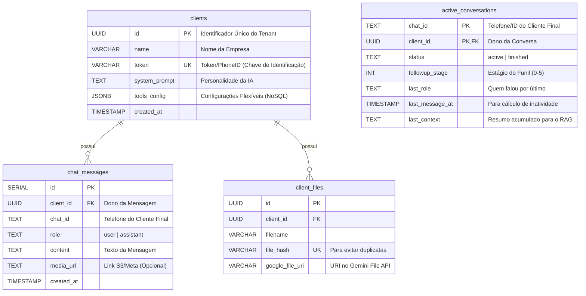

# 💾 Banco de Dados (PostgreSQL)

O Kestra 2.0 utiliza PostgreSQL como fonte única de verdade (Single Source of Truth), com uma arquitetura **Multi-Tenant Lógica** (todos os clientes no mesmo banco, separados por ID).

## 🗄️ Diagrama Entidade-Relacionamento (ER)



## 📋 Detalhe das Tabelas

### 1. `clients` (Mestre)
A tabela mais importante. Cada linha representa um **SaaS Tenant** (uma empresa cliente).

| Coluna | Tipo | Descrição |
| :--- | :--- | :--- |
| `id` | UUID | Gerado automaticamente (`gen_random_uuid()`). Chave Primária. |
| `token` | VARCHAR | **Crítico.** Usado pelos Webhooks para saber de qual empresa é a mensagem. Pode ser um Token Uazapi ou o PhoneID da Meta. |
| `tools_config` | JSONB | Armazena configurações dinâmicas (Toggles, Credenciais de API) sem precisar de migração de esquema. |

#### Exemplo de `tools_config` (JSONB):
```json
{
  "ai_active": true,
  "start_upper": false,
  "consultar_cep": {
    "active": true
  },
  "whatsapp": {
    "url": "https://api.z-api.io/...",
    "key": "secret-key"
  }
}
```

### 2. `active_conversations` (State Machine)
Tabela vital para os **Workers de Follow-up**. Ela mantém o "estado atual" de cada conversa, permitindo que os scripts saibam quem precisa de resposta ou reengajamento.
*   **Chave Primária Composta:** `(chat_id, client_id)`. Garante 1 estado por cliente/conversa.
*   **`followup_stage`:** Controla em qual passo do funil de vendas o cliente está.
*   **`last_context`:** Uma "memória de curto prazo" que os Workers consultam para não perder o fio da meada.

### 3. `chat_messages` (Histórico)
Armazena o histórico de conversa para exibir na interface "Inbox 2.0" e para fornecer contexto ("Memória") para a IA.
*   **Particionamento:** Os dados não são fisicamente separados. A segurança é garantida pela cláusula `WHERE client_id = ...` em todas as queries no `saas_db.py`.


## ⚙️ Acesso a Dados (DAO)

Todo o acesso é centralizado no módulo `scripts/shared/saas_db.py`.

### Connection Pooling
Não abrimos uma conexão por requisição (isso mataria o banco). Usamos `psycopg_pool`.
*   O Pool mantém conexões vivas e as reusa.
*   `max_size=20`: Permite até 20 threads simultâneas de banco.

### Padrão Singleton
O pool é inicializado apenas uma vez por processo Python.
```python
# saas_db.py
_pool = ConnectionPool(...)

def get_connection():
    return _pool.connection()  # Empresta uma conexão
```
