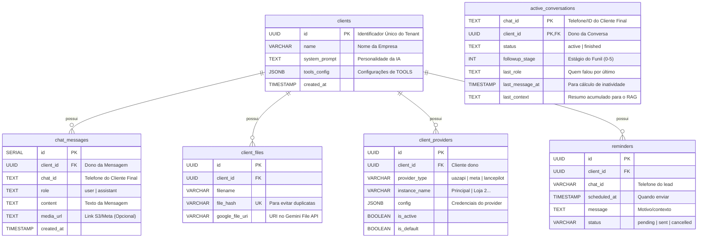

# 💾 Banco de Dados (PostgreSQL)

O Kestra 2.0 utiliza PostgreSQL como fonte única de verdade (Single Source of Truth), com uma arquitetura **Multi-Tenant Lógica** (todos os clientes no mesmo banco, separados por ID).

## 🗄️ Diagrama Entidade-Relacionamento (ER)



## 📋 Detalhe das Tabelas

### 1. `clients` (Mestre)
A tabela mais importante. Cada linha representa um **SaaS Tenant** (uma empresa cliente).

| Coluna | Tipo | Descrição |
| :--- | :--- | :--- |
| `id` | UUID | Gerado automaticamente (`gen_random_uuid()`). Chave Primária. |
| `name` | VARCHAR | Nome da empresa cliente. |
| `tools_config` | JSONB | Configurações das **Tools da IA** (consultar_cep, enviar_relatorio, criar_lembrete, etc). |

> **ADR-002 (2026-01):** O campo `token` foi **deprecado**. Credenciais de providers agora ficam em `client_providers`.

#### Exemplo de `tools_config` (JSONB):
```json
{
  "consultar_cep": {"active": true},
  "criar_lembrete": {"active": true},
  "enviar_relatorio": {"active": true, "grupo_id": "123..."},
  "consultar_viabilidade_hubsoft": {"active": true, "api_url": "...", "client_id": "..."}
}
```

### 2. `client_providers` (Provedores de Comunicação)
**Nova tabela (2026-01).** Armazena credenciais dos providers de WhatsApp.

| Coluna | Tipo | Descrição |
| :--- | :--- | :--- |
| `id` | UUID | Chave Primária. |
| `client_id` | UUID | FK para `clients`. |
| `provider_type` | VARCHAR | `uazapi`, `meta`, ou `lancepilot`. |
| `instance_name` | VARCHAR | Nome da instância (ex: "Principal", "Loja 2"). |
| `config` | JSONB | Credenciais específicas do provider. |
| `is_active` | BOOLEAN | Se está ativo. |
| `is_default` | BOOLEAN | Se é o provider padrão. |

#### Exemplo de `config` por provider:
```json
// Uazapi
{"url": "https://api.z-api.io/...", "token": "abc123..."}

// Meta (Oficial)
{"phone_id": "123...", "access_token": "EAA...", "waba_id": "..."}

// LancePilot
{"token": "...", "workspace_id": "...", "number": "..."}
```

### 3. `reminders` (Lembretes Agendados)
**Nova tabela (2026-01).** Armazena lembretes para follow-up agendado.

| Coluna | Tipo | Descrição |
| :--- | :--- | :--- |
| `id` | UUID | Chave Primária. |
| `client_id` | UUID | FK para `clients`. |
| `chat_id` | VARCHAR | Telefone do lead. |
| `scheduled_at` | TIMESTAMP | Quando enviar o lembrete. |
| `message` | TEXT | Motivo/contexto do lembrete. |
| `status` | VARCHAR | `pending`, `sent`, `cancelled`, `error`. |

### 4. `active_conversations` (State Machine)
Tabela vital para os **Workers de Follow-up**. Ela mantém o "estado atual" de cada conversa, permitindo que os scripts saibam quem precisa de resposta ou reengajamento.
*   **Chave Primária Composta:** `(chat_id, client_id)`. Garante 1 estado por cliente/conversa.
*   **`followup_stage`:** Controla em qual passo do funil de vendas o cliente está.
*   **`last_context`:** Uma "memória de curto prazo" que os Workers consultam para não perder o fio da meada.

### 5. `chat_messages` (Histórico)
Armazena o histórico de conversa para exibir na interface "Inbox 2.0" e para fornecer contexto ("Memória") para a IA.
*   **Particionamento:** Os dados não são fisicamente separados. A segurança é garantida pela cláusula `WHERE client_id = ...` em todas as queries no `saas_db.py`.


## ⚙️ Acesso a Dados (DAO)

Todo o acesso é centralizado no módulo `scripts/shared/saas_db.py`.

### Connection Pooling
Não abrimos uma conexão por requisição (isso mataria o banco). Usamos `psycopg_pool`.
*   O Pool mantém conexões vivas e as reusa.
*   **`max_size`**: Configurável via variável de ambiente `DB_POOL_MAX_SIZE` (default: 5).
*   **`timeout`**: 30 segundos para evitar travamentos.

### Configuração via Ambiente
```bash
# No .env ou docker-compose
DB_POOL_MAX_SIZE=10  # Aumenta para 10 conexões por container
```

### PostgreSQL `max_connections`
Para escalar, aumente `max_connections` no PostgreSQL:
```yaml
# docker-compose.yaml
services:
  postgres:
    command: postgres -c max_connections=500 -c shared_buffers=512MB
```

### Padrão Singleton
O pool é inicializado apenas uma vez por processo Python.
```python
# saas_db.py
_pool = ConnectionPool(
    conninfo=DB_URL,
    min_size=1,
    max_size=DB_POOL_MAX_SIZE,  # Configurável via env
    timeout=30.0,
)

def get_connection():
    return _pool.connection()  # Empresta uma conexão
```

### Controle de Concorrência (Kestra)
Para evitar esgotar conexões, os flows usam `concurrency`:
```yaml
concurrency:
  limit: 10      # Máximo 10 execuções simultâneas
  behavior: QUEUE  # Extras entram em fila
```

