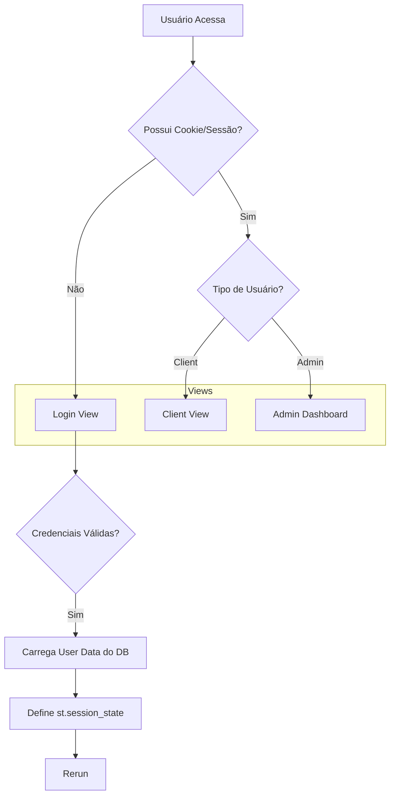
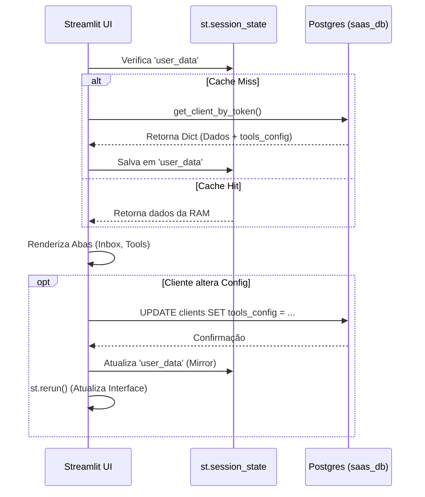

# 🎨 Frontend (Streamlit) - Referência Completa

Esta documentação descreve a arquitetura de interface do Kestra 2.0.
O sistema utiliza **Streamlit** como framework Fullstack (UI + Lógica de Servidor), organizado em módulos.

## 🗺️ Mapa de Navegação (Routing)

O arquivo `app.py` atua como **Controller Principal**. Ele gerencia a sessão e decide qual "View" apresentar.



## 🏗️ Estrutura de Arquivos

### 1. Controladores (`root/`)
*   **`app.py`:** Ponto de entrada p/ Clientes. Verifica autenticação via `scripts/shared/auth_utils.py`.
*   **`admin_dashboard.py`:** Ponto de entrada p/ Super Admins (separado por segurança). Conecta direto no banco para criar Tenants.

### 2. Views e Abas (`views/`)
*   **`login_view.py`:** Formulário simples de usuário/senha.
*   **`client_view.py`:** Wrapper que chama `client_dashboard/main.py`.
*   **`client_dashboard/`:** A "Área Logada" do cliente.

#### 📂 `views/static/`
Conteúdo estático servido pelo Streamlit ou embutido via iframe.
*   **`facebook-embedded-signup.html`:** HTML crítico para o fluxo "Endedded Signup" da Meta. O usuário clica, abre um popup do Facebook, loga, e o HTML recebe um `code` via `postMessage`. O Streamlit captura esse token para criar a conexão WABA (WhatsApp Business API).

---

## 💾 Banco de Dados & Estado

O Frontend não acessa o banco diretamente nas Views (má prática). Ele usa a camada DAO (`scripts/shared/saas_db.py`).

### Ciclo de Vida do Dado


### JSONB: O Segredo da Flexibilidade
Para evitar Migrations constantes toda vez que criamos uma feature nova (ex: "Integração Betel"), usamos uma coluna `JSONB` chamada `tools_config`.

*   **Vantagem:** O Frontend pode criar checkboxes e campos novos (`st.toggle`, `st.text_input`) e salvar direto nesse JSON.
*   **Estrutura:**
    ```json
    {
      "ai_active": true,
      "whatsapp": { "url": "...", "key": "..." },
      "consultar_cep": { "active": true }
    }
    ```

---

## 🛠️ Detalhe dos Módulos (Deep Dive)

### 1. Admin Dashboard (`admin_dashboard.py`)
Painel "Cru" para o dono do SaaS.
*   **Create Client:** `INSERT INTO clients`. Gera um `store_id` (UUID + Timestamp) para a **Google Gemini Vector Store**.
*   **List Clients:** `SELECT * FROM clients`. Mostra quem está pagando.
*   **Debug:** Ferramenta para limpar histórico de chat (`DELETE FROM chat_messages`).

### 2. Inbox 2.0 (`whatsapp_tab.py`)
A joia da coroa.
*   **Desafio:** O `st.chat_message` nativo é feio e limitado.
*   **Solução:** Injeção de CSS (`views/client_dashboard/styles/inbox_styles.py`) e HTML bruto (`render_message_bubble`).
*   **Resultado:** Balões alinhados (Esq/Dir), cores do WhatsApp (Verde/Branco) e Timestamp formatado.

### 3. Connection Tab (`connection_tab.py`)
*   **Lógica Async:** O Streamlit é síncrono, mas a API do Uazapi exige espera. Usamos `asyncio.run()` para chamar as funções de conexão sem travar a thread principal do Python.

### 4. Files Tab (`files_tab.py`) (RAG)
*   **Função:** Upload de PDF/TXT para a Base de Conhecimento da IA.
*   **Backstage:** O arquivo é enviado diretamente para a **Google Gemini Vector Store** (via `gemini_service.py`), onde é indexado nativamente pela API da Google (GenAI). Não utilizamos banco vetorial local.

---
**Legenda para Desenvolvedores:**
*   **State:** Memória temporária (perde no F5).
*   **DB:** Memória persistente (Postgres).
*   **Rerun:** Recarregar a página (necessário após salvar no DB para refletir mudanças).
